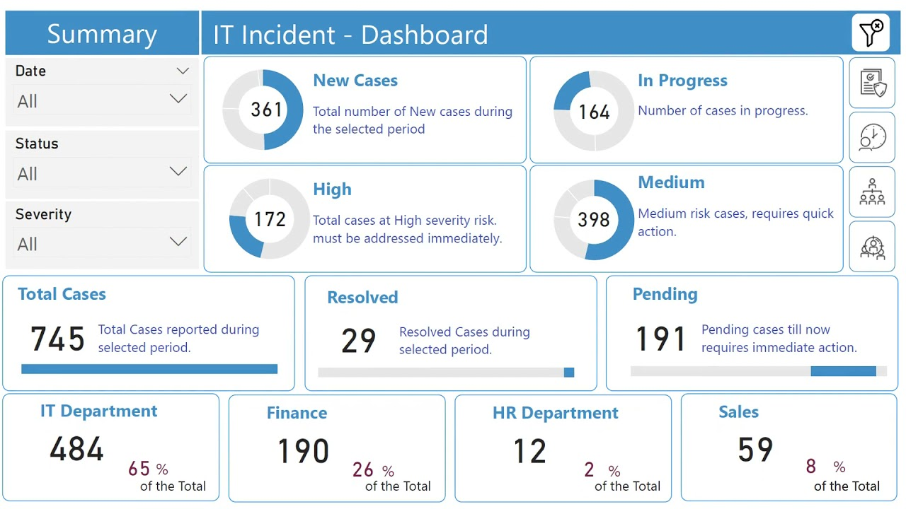
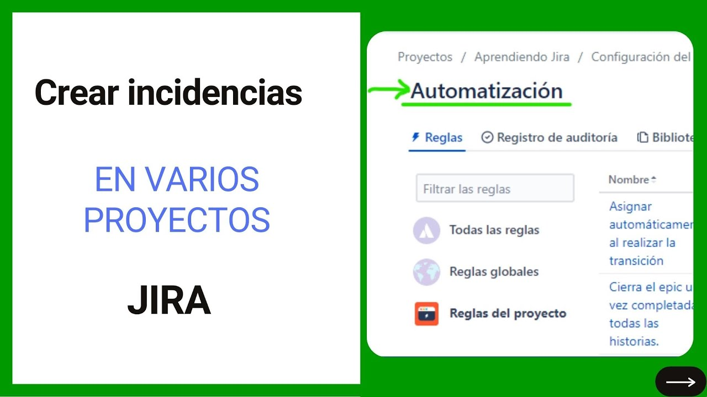

# SIGI

**Sistema de Gestión de Incidencias con Inteligencia Artificial**

SIGI Local es un sistema completo de gestión de incidencias que utiliza inteligencia artificial para automatizar la clasificación, análisis de sentimientos, detección de duplicados y generación de respuestas automáticas. Diseñado para organizaciones que necesitan una solución robusta y moderna para el manejo eficiente de tickets e incidencias.



## 🚀 Características Principales

### 🤖 Inteligencia Artificial Integrada
- **Clasificación Automática**: Utiliza DistilBERT para categorizar incidencias automáticamente
- **Análisis de Sentimientos**: Evalúa el tono emocional de las incidencias
- **Detección de Duplicados**: Identifica incidencias similares para evitar trabajo redundante
- **Respuestas Automáticas**: Genera respuestas inteligentes basadas en el contexto

### 📊 Dashboard Interactivo
- **Visualizaciones en Tiempo Real**: Gráficos dinámicos con Plotly
- **Métricas Clave**: KPIs y estadísticas de rendimiento
- **Filtros Avanzados**: Búsqueda y filtrado por múltiples criterios
- **Exportación de Datos**: Descarga de reportes en varios formatos

### 🔧 API RESTful Completa
- **Endpoints Documentados**: Documentación automática con Swagger/OpenAPI
- **Operaciones CRUD**: Gestión completa de incidencias
- **Análisis en Tiempo Real**: Procesamiento inmediato con IA
- **Sistema de Feedback**: Mejora continua del modelo ML

### 💾 Base de Datos Robusta
- **SQLite Integrado**: Sin configuración adicional requerida
- **Esquema Optimizado**: Diseño eficiente para consultas rápidas
- **Migración Automática**: Inicialización automática de la base de datos

## 📋 Requisitos del Sistema

### Requisitos Mínimos
- **Sistema Operativo**: Windows 10+, macOS 10.14+, Ubuntu 18.04+
- **Python**: 3.8 o superior (recomendado 3.11)
- **RAM**: 4GB mínimo (8GB recomendado)
- **Espacio en Disco**: 2GB libres
- **Conexión a Internet**: Para descarga inicial de modelos ML

### Dependencias Principales
- FastAPI 0.104.1 - Framework web moderno
- Streamlit 1.28.1 - Dashboard interactivo
- Transformers 4.35.2 - Modelos de IA
- PyTorch 2.1.1 - Framework de ML
- SQLAlchemy 2.0.23 - ORM para base de datos
- Pandas 2.1.4 - Análisis de datos
- Plotly 5.17.0 - Visualizaciones

## 🛠️ Instalación

### Paso 1: Clonar el Repositorio
```bash
git clone https://github.com/pdro-ruiz/sigi-local.git
cd sigi-local
```

### Paso 2: Verificar Python
```bash
python --version
# Debe mostrar Python 3.8 o superior
```

Si no tienes Python instalado:
- **Windows**: Descarga desde [python.org](https://python.org)
- **macOS**: `brew install python` o desde python.org
- **Ubuntu/Debian**: `sudo apt update && sudo apt install python3 python3-pip`

### Paso 3: Crear Entorno Virtual
```bash
# Crear entorno virtual
python -m venv venv

# Activar entorno virtual
# En Windows:
venv\Scripts\activate
# En macOS/Linux:
source venv/bin/activate
```

### Paso 4: Instalar Dependencias
```bash
# Actualizar pip
pip install --upgrade pip

# Instalar dependencias
pip install -r requirements.txt
```

**Nota**: La primera instalación puede tomar varios minutos debido a la descarga de modelos de IA.

### Paso 5: Configuración Inicial
```bash
# Inicializar base de datos
python scripts/init_database.py

# Cargar datos de ejemplo (opcional)
python scripts/seed_data.py

# Verificar instalación
python scripts/check_dependencies.py
```

## ⚙️ Configuración

### Variables de Entorno
Crea un archivo `.env` en la raíz del proyecto:

```env
# Configuración API
API_HOST=127.0.0.1
API_PORT=8000
API_TITLE=SIGI Local API
API_VERSION=1.0.0

# Configuración Dashboard
STREAMLIT_PORT=8501

# Base de Datos
DATABASE_URL=sqlite:///data/database/sigi_local.db

# Logging
LOG_LEVEL=INFO
LOG_FILE=logs/sigi_local.log

# Modelos ML
ML_MODEL_PATH=ml/models/
ENABLE_GPU=false
```

### Configuración de Modelos ML
Los modelos se descargan automáticamente en el primer uso. Para configuración avanzada:

```python
# config/settings.py
ML_MODELS = {
    "classification": "distilbert-base-uncased",
    "sentiment": "cardiffnlp/twitter-roberta-base-sentiment-latest",
    "similarity": "sentence-transformers/all-MiniLM-L6-v2"
}
```

## 🚀 Ejecución del Sistema

### Método 1: Inicio Automático (Recomendado)
```bash
# Activar entorno virtual
source venv/bin/activate  # Linux/macOS
# o
venv\Scripts\activate     # Windows

# Iniciar todos los servicios
python start.py
```

Este comando iniciará automáticamente:
- API FastAPI en http://127.0.0.1:8000
- Dashboard Streamlit en http://127.0.0.1:8501

### Método 2: Inicio Manual

#### Iniciar API
```bash
# Terminal 1
source venv/bin/activate
python run_api.py
# o
uvicorn app.main:app --host 127.0.0.1 --port 8000 --reload
```

#### Iniciar Dashboard
```bash
# Terminal 2
source venv/bin/activate
python run_dashboard.py
# o
streamlit run frontend/dashboard.py --server.port 8501
```

### Verificación de Servicios
- **API**: http://127.0.0.1:8000
- **Documentación API**: http://127.0.0.1:8000/docs
- **Dashboard**: http://127.0.0.1:8501
- **Health Check**: http://127.0.0.1:8000/health

## 📖 Guía de Uso

### 1. Acceso al Dashboard
1. Abre tu navegador en http://127.0.0.1:8501
2. Verás el dashboard principal con métricas en tiempo real
3. Utiliza la barra lateral para navegar entre secciones


### 2. Crear Nueva Incidencia
1. Ve a la sección "Nueva Incidencia"
2. Completa el formulario:
   - **Título**: Descripción breve del problema
   - **Descripción**: Detalles completos de la incidencia
   - **Usuario**: Persona que reporta
   - **Prioridad**: Nivel de urgencia inicial
3. Haz clic en "Crear Incidencia"
4. El sistema automáticamente:
   - Clasifica la incidencia por categoría
   - Analiza el sentimiento
   - Detecta posibles duplicados
   - Genera respuesta sugerida



### 3. Gestión de Incidencias
- **Ver Todas**: Lista completa con filtros avanzados
- **Buscar**: Por título, descripción, usuario o categoría
- **Filtrar**: Por estado, prioridad, fecha, categoría
- **Actualizar**: Cambiar estado, asignar técnico, añadir comentarios
- **Cerrar**: Marcar como resuelto con solución

### 4. Análisis y Reportes
- **Métricas en Tiempo Real**: Incidencias abiertas, cerradas, por categoría
- **Gráficos Interactivos**: Tendencias, distribuciones, rendimiento
- **Exportar Datos**: CSV, Excel, PDF
- **Análisis de Sentimientos**: Satisfacción del usuario


## 🔌 API Endpoints

### Incidencias
| Método | Endpoint | Descripción |
|--------|----------|-------------|
| `GET` | `/api/incidents/` | Listar todas las incidencias |
| `POST` | `/api/incidents/` | Crear nueva incidencia |
| `GET` | `/api/incidents/{id}` | Obtener incidencia específica |
| `PUT` | `/api/incidents/{id}` | Actualizar incidencia |
| `DELETE` | `/api/incidents/{id}` | Eliminar incidencia |
| `POST` | `/api/incidents/{id}/feedback` | Enviar feedback sobre clasificación |

### Análisis
| Método | Endpoint | Descripción |
|--------|----------|-------------|
| `POST` | `/api/analyze/classify` | Clasificar texto |
| `POST` | `/api/analyze/sentiment` | Análisis de sentimientos |
| `POST` | `/api/analyze/duplicates` | Detectar duplicados |
| `POST` | `/api/analyze/response` | Generar respuesta automática |

### Dashboard
| Método | Endpoint | Descripción |
|--------|----------|-------------|
| `GET` | `/api/dashboard/stats` | Estadísticas generales |
| `GET` | `/api/dashboard/metrics` | Métricas de rendimiento |
| `GET` | `/api/dashboard/trends` | Tendencias temporales |

### Ejemplos de Uso

#### Crear Incidencia
```bash
curl -X POST "http://127.0.0.1:8000/api/incidents/" \
  -H "Content-Type: application/json" \
  -d '{
    "title": "Error en sistema de login",
    "description": "Los usuarios no pueden acceder al sistema desde esta mañana",
    "user_name": "juan.perez@empresa.com",
    "priority": "high"
  }'
```

#### Obtener Estadísticas
```bash
curl -X GET "http://127.0.0.1:8000/api/dashboard/stats"
```

## 🏗️ Arquitectura del Sistema

```
sigi-local/
├── app/                    # Aplicación principal FastAPI
│   ├── api/               # Endpoints de la API
│   │   ├── incidents.py   # Gestión de incidencias
│   │   ├── analysis.py    # Análisis con IA
│   │   └── dashboard.py   # Datos para dashboard
│   ├── models/            # Modelos de datos
│   │   ├── database.py    # Configuración SQLAlchemy
│   │   └── schemas.py     # Esquemas Pydantic
│   ├── services/          # Lógica de negocio
│   │   ├── database_service.py  # Operaciones BD
│   │   ├── ml_service.py        # Servicios ML
│   │   └── analytics_service.py # Análisis de datos
│   └── main.py           # Aplicación FastAPI principal
├── frontend/             # Dashboard Streamlit
│   ├── dashboard.py      # Aplicación principal
│   ├── components/       # Componentes reutilizables
│   └── static/          # Archivos estáticos
├── config/              # Configuración
│   └── settings.py      # Variables de configuración
├── data/               # Datos y base de datos
│   ├── database/       # Archivos SQLite
│   ├── models/         # Modelos ML entrenados
│   └── templates/      # Plantillas de respuesta
├── ml/                 # Módulos de Machine Learning
│   ├── classifiers/    # Clasificadores
│   ├── sentiment/      # Análisis de sentimientos
│   ├── duplicates/     # Detección de duplicados
│   └── responses/      # Generación de respuestas
├── scripts/            # Scripts de utilidad
│   ├── init_database.py    # Inicializar BD
│   ├── seed_data.py        # Datos de ejemplo
│   └── check_dependencies.py # Verificar instalación
└── tests/              # Pruebas unitarias
```

### Flujo de Datos
1. **Usuario** crea incidencia en Dashboard
2. **Frontend** envía datos a API FastAPI
3. **API** guarda en base de datos SQLite
4. **ML Service** procesa con modelos de IA
5. **Resultados** se almacenan y muestran en Dashboard

## 🔧 Troubleshooting

### Problemas Comunes

#### Error: "ModuleNotFoundError"
```bash
# Solución: Verificar entorno virtual activado
source venv/bin/activate  # Linux/macOS
venv\Scripts\activate     # Windows

# Reinstalar dependencias
pip install -r requirements.txt
```

#### Error: "Port already in use"
```bash
# Verificar procesos usando los puertos
lsof -i :8000  # API
lsof -i :8501  # Dashboard

# Terminar procesos
kill -9 <PID>

# O usar puertos diferentes
uvicorn app.main:app --port 8001
streamlit run frontend/dashboard.py --server.port 8502
```

#### Error: "Database locked"
```bash
# Reinicializar base de datos
rm data/database/sigi_local.db
python scripts/init_database.py
```

#### Error: "CUDA out of memory" (GPU)
```bash
# Deshabilitar GPU en .env
ENABLE_GPU=false

# O reducir batch size en config/settings.py
ML_BATCH_SIZE=1
```

#### Dashboard no carga
```bash
# Verificar API funcionando
curl http://127.0.0.1:8000/health

# Limpiar cache Streamlit
streamlit cache clear

# Reiniciar servicios
python start.py
```

#### Modelos ML no descargan
```bash
# Verificar conexión internet
ping huggingface.co

# Descargar manualmente
python -c "from transformers import AutoModel; AutoModel.from_pretrained('distilbert-base-uncased')"

# Verificar espacio en disco
df -h
```

### Logs y Debugging

#### Ver logs en tiempo real
```bash
# Logs de la aplicación
tail -f logs/sigi_local.log

# Logs de uvicorn
uvicorn app.main:app --log-level debug

# Logs de streamlit
streamlit run frontend/dashboard.py --logger.level debug
```

#### Modo debug
```bash
# Activar debug en .env
DEBUG=true
LOG_LEVEL=DEBUG

# Ejecutar con debug
python -m debugpy --listen 5678 --wait-for-client run_api.py
```

### Rendimiento

#### Optimizar base de datos
```bash
# Ejecutar script de optimización
python scripts/optimize_database.py

# Crear índices adicionales
python scripts/create_indexes.py
```

#### Monitorear recursos
```bash
# CPU y memoria
htop

# Espacio en disco
du -sh data/

# Conexiones de red
netstat -tulpn | grep :8000
```

## 🧪 Testing

### Ejecutar Pruebas
```bash
# Todas las pruebas
pytest

# Pruebas específicas
pytest tests/test_api.py
pytest tests/test_ml.py

# Con cobertura
pytest --cov=app tests/
```

### Pruebas de Carga
```bash
# Instalar herramientas
pip install locust

# Ejecutar pruebas de carga
locust -f tests/load_test.py --host=http://127.0.0.1:8000
```

## 🤝 Contribuciones

### Cómo Contribuir
1. Fork el repositorio
2. Crea una rama para tu feature (`git checkout -b feature/nueva-funcionalidad`)
3. Commit tus cambios (`git commit -am 'Añadir nueva funcionalidad'`)
4. Push a la rama (`git push origin feature/nueva-funcionalidad`)
5. Crea un Pull Request

### Estándares de Código
- **Python**: PEP 8, type hints, docstrings
- **JavaScript**: ES6+, JSDoc
- **Testing**: Cobertura mínima 80%
- **Documentación**: README actualizado

### Reportar Bugs
Usa el [issue tracker](https://github.com/tu-usuario/sigi-local/issues) con:
- Descripción detallada del problema
- Pasos para reproducir
- Logs relevantes
- Información del sistema


**¡Gracias por usar SIGI Local!** 🎉

Si este proyecto te ha sido útil, considera darle una ⭐ en GitHub y compartirlo con otros desarrolladores.

---

*Última actualización: Junio 2025*